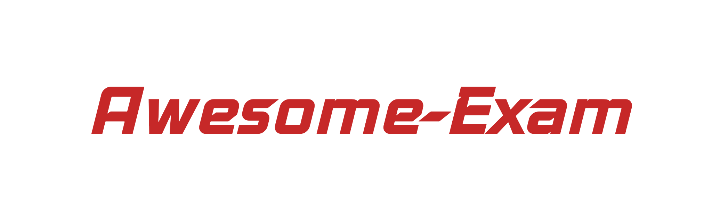

# Awesome Exam 

> A list for exams in HUST

## Contents

- [Freshman](#Freshman)

## Freshman

- [Ideological and moral cultivation and legal basis](#Ideological-and-moral-cultivation-and-legal-basis)
- [Chinese](#Chinese)

### Ideological and moral cultivation and legal basis

- [By Colin](https://outsiders.top)
- [By Maniacata](https://github.com/ManiaciaChao/how-to-preview/tree/master/%E6%80%9D%E4%BF%AE%E4%B8%8E%E6%B3%95%E5%BE%8B%E5%9F%BA%E7%A1%80)

### Chinese

- [By Colin](https://outsiders.top)

## Contribute

Contributions welcome! Read the [contribution guidelines](contributing.md) first.

## LICENSE

To the extent possible under law, [Colin Wang](https://outsiders.top) has waived all copyright and
related or neighboring rights to Awesome-exam.This work is published from: 中国大陆.
