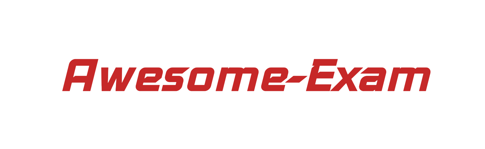

# 

## 内容

- [大一](#大一)

## 大一

- [思想道德修养与法律基础](#思想道德修养与法律基础)
- [中国语文](#中国语文)

### 思想道德修养与法律基础

- [By Colin](https://outsiders.top/2019/01/11/Ideological-and-moral-cultivation-and-legal-basis/)
- [By Maniacata](https://github.com/ManiaciaChao/how-to-preview/tree/master/%E6%80%9D%E4%BF%AE%E4%B8%8E%E6%B3%95%E5%BE%8B%E5%9F%BA%E7%A1%80)

### 中国语文

- [By Colin](https://outsiders.top/2019/01/11/Chinese/)

### C语言程序设计

- [By Codedragon](https://blog.codedragon.tech/2016/06/20/c-e8-af-ad-e8-a8-80-e5-a4-8d-e4-b9-a0-e9-97-ae-e9-a2-98-e6-80-bb-e7-bb-93)

### 计算思维

- [By Zippermonkey](https://zippermonkey.github.io/2019/01/14/Computational-Thinking/)

## 贡献

**如果你有好的考试资源，欢迎做出贡献！**
请首先阅读[贡献指南](contributing.md)。

## LICENSE

To the extent possible under law, [Colin Wang](https://outsiders.top) has waived all copyright and
related or neighboring rights to Awesome-exam.This work is published from: 中国大陆.
