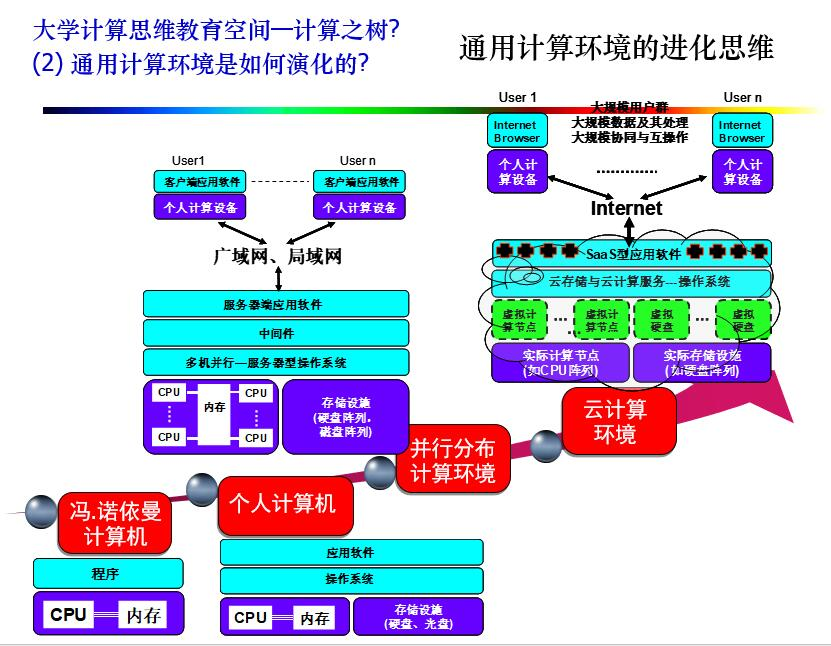
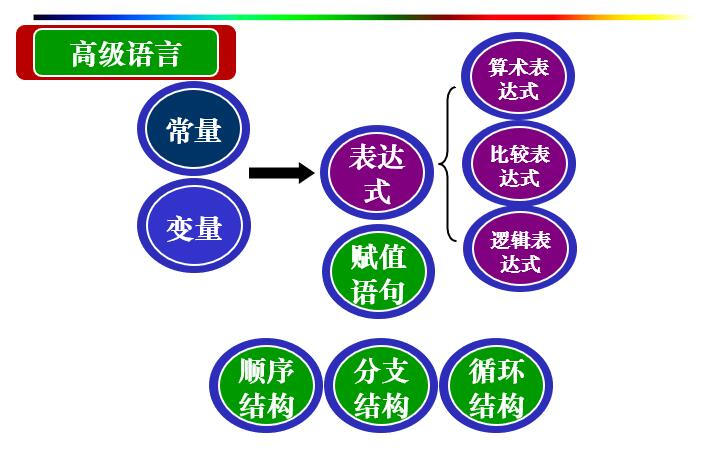

# 第一讲 绪论

## 计算机是什么

<!--more-->

## 为什么要学习和怎样学习大学计算机课程

1. 计算学科的供需关系

2. 计算科学与信息探索科学已成为科学创新的重要方面

3. 各学科人才需要计算思维，以便形成复合型的创造性思维

4. 站得高，才能看得远；看得远，才能看得真

    > 计算思维(Computational Thinking)是运用计算机科学的基础概念去求解问题、设计系统和理解人类行为，其本质是抽象和自动化——from 周以真。

5. 知识和思维的差别在哪里

    

6. 大学计算机与其他课程的关系是怎样的
    知识 vs 思维 vs 能力
    * 能力：知识与视野拓展
    * 知识/技能：训练与掌握（计算机语言与程序设计  数学建模或非数学建模 数据库...）
    * 思维：启发与理解：计算思维导论

7. 只要坚持，就能学好大学计算机-计算思维导论课程

8. 你一定能学好大学计算机-计算思维导论

## 计算与自动计算

### 什么是计算

* 简单计算：数据计算 计算规则 应用计算规则进行计算并获得计算结果
    >3+2=5; 5-4=1; 3*2=6
* 复杂计算1：函数 计算规则及其简化计算方法，便于人应用规则进行计算 获得计算结果
    > 

* 复杂计算2：如丢番图方程，判定，计算规则，人可能无法完成但却可由机器自动完成，借助于机器获得计算结果
    > 

### 人计算与机器计算的区别

#### 人进行计算

* 规则可能很复杂, 但计算量却可能很小

* 人需要知道具体的计算规则

* 特定规则，只能求: a1x2+a2x=c

#### 机器-自动运算

* 规则可能很简单, 但计算量却很大

* 机器也可以采用人所使用的计算规则

* 一般性的规则，可以求任意:
  a1x1b1+a2x2b2+…+anxnbn=c

### 自动计算需要解决什么问题？

自动计算要解决的几个问题：表示-存储-执行

* 数据的表示

* “计算规则”的表示：程序

* 数据与计算规则的“自动存储”

* 计算规则的“自动执行”

### 机械计算的探索？

* 帕斯卡与帕斯卡机
    > 它告诉人们“用纯机械装置可代替人的思维和记忆”。开辟了自动计算的道路。
* 1834年：巴贝奇 (Charles Babbage)，分析机的概念----可执行程序的机器。
* 1805年： 杰卡德 (J. Jacquard)，打孔卡，实践了输入手段问题。
* 1854年：布尔创立布尔代数，为数字计算机的电路设计提供了理论基础。

#### 机械计算的简要发展历程

计算辅助工具->帕斯卡机械计算机：自动计算-固定的计算规则->巴贝奇机械计算机：（特定）程序-可有限变化的计算规则->现代计算机：一般程序-任意变化的计算规则

### 计算与自动计算小结

> 

## 电子自动计算-元器件

### 自动计算需要解决的问题？

> 

### 电子自动计算的突破在哪里

* 冯.诺伊曼(Von Neumann)电子计算机EDVAC问世

* 将运算和存储分离，运算速度却比拥有18000个电子管的“ENIAC”提高了10倍

* 结构上的创新：“冯.诺伊曼计算机”

### 晶体管发现的价值在哪？

(可靠性更高 体积更小 可控性更灵活)

### 什么是集成电路，其价值又在哪里呢？

> 能否将复杂的电路封装后作为新电路设计的元件呢? 复杂的电路->集成->封装->应用？

### 元器件发展的轨迹是怎样的，每个阶段要解决什么问题？

> 

## 电子自动计算-计算机系统

### 计算机系统的构成包括哪些部分

    计算机系统要解决的几个问题

* “控制与计算”----微处理器
* “输入”----如何将外部信息输入到计算机中?
* “输出”----如何将计算机中信息输出到外界(显示或打印)?
* “永久存储与临时存储”----如何将计算机中的信息永久保存或临时保存?

### 计算机系统各主要部件的发展趋势是什么？

## 计算系统之发展趋势

* 微型化趋势：可嵌入可携带
* 大型化趋势：可进行大规模复杂计算
* 智能化趋势：理解自然语言，具有自适应性，自主完成复杂功能
* 网络化：机-机相联，物-物相联，物-人相联，人-人相联

## 大学计算思维教育空间——计算之树

### 计算之树的第一个维度--计算技术的奠基性思维

> 

### 计算之树的第二个维度—通用计算环境的进化思维

> 

### 计算之树的第三个维度—交替促进与共同进化的问题求解思维

> 

### 计算之树的第四个维度—计算与社会/自然环境的融合思维

> 

### 网路化思维 数据化思维

> 

# 第二讲 符号化-计算化-自动化

## 0和1 语意符号化表达与计算

* 将现象抽象为符号，进行符号组合，利用符号组合表达自然现象

* 更多的组合，更多的语义，更多的变化

* 符号化的关键是区分与命名---术语体系

* 符号化的目的是基于符号的演算--符号组合的变化方式

* 将符号再赋予语义 ---“本”与“用”：抽象与具体化

> 
> 语义符号化->符号计算化->计算0(和)1化
->0(和) 1自动化->分层构造化->构造集成化

## 思维符号化表达与计算

### 什么是逻辑

逻辑是指事物因果之间所遵循的规律，是现实中普适的思维方式

* 逻辑的基本表现形式是命题与推理，推理即依据由简单命题的判断推导得出复杂命题的判断结论的过程。命题由语句表述，即内容为“真”或为“假”的一个判断语句！

### 基本逻辑操作

与 
或 
非 
异或

### 怎样符号化逻辑并进行运算

> 用0和1来表示逻辑运算
> 

### 逻辑研究有哪些

* 1)Aristotle (亚里士多德)(公元前384－322)。古希腊哲学家：形式逻辑。 典型概念：命题，推理，三段论
* 2)Leibnitz (莱布尼茨)(1646－1716)。德国数学家：数理逻辑。 典型概念：谓词，谓词演算
* 3)Boole (布尔) (1815－1864)。英国数学家，布尔代数 典型概念：布尔量, 布尔值, 布尔运算, 布尔操作
* 4)其他：时序逻辑(Temporal Logics)、模态逻辑(Modal Logics)、归纳逻辑(Inductive Logics)、模糊逻辑(Fuzzy Logics)、粗糙逻辑(Rough Logics)、非单调逻辑等

### 思维符号化小结

> 

## 0和1与数值

> 

## 0和1与非数值

> 非数值性信息可以用编码表示

编码的三个主要特征

* 唯一性：每一种组合都有确定的唯一性的含义
* 公共性：所有相关者都认同、遵守、使用这种编码
* 易于记忆/便于识认性：有一定规律

## 0和1与电子技术实现

### 如何使用电信号及电子元件表达0和1？

实现0和1的基本元器件: 电信号和继电器开关

### 处理0和1的基本元件？

实现0和1的基本元器件: 二极管

实现0和1的基本元器件: 三极管

三极管的基本特性：

* 开关和放大
* 以较小的b极电流信号可控制较大的e极流过的电流--放大

### 如何用基本电子元件实现基本逻辑运算？

用二极管、三极管可实现基本的集成电路: 与门、或门和非门

* 这些电路被封装成集成电路(芯片)，即所谓的门电路。

### 如何用电信号及电子元件实现基本逻辑运算？

> 

## 本章总结

> 

# 第三讲 图灵机的思想与模型简介 冯诺依曼机

## 图灵认为什么是计算？

所谓计算就是计算者(人或机器)对一条两端可无限延长的纸带上的一串0或1，执行指令一步一步地改变纸带上的0或1，经过有限步骤最后得到一个满足预先规定的符号串的变换过程。

### 图灵机的思想

> 是关于数据、指令、程序及程序/指令自动执行的基本思想。
> 

### **图灵机是什么**

1. 图灵机是一种思想模型，它由一个控制器(有限状态转换器)，一条可无限延伸的带子和一个在带子上左右移动的读写头构成。
2. **程序是五元组(q,X,Y,R(或L或N),p)形式的指令集**。其定义了机器在一个特定状态q下从方格中读入一个特定字符X时所采取的动作为在该方格中写入符号Y, 然后向右移一格R (或向左移一格L或不移动N), 同时将机器状态设为p供下一条指令使用。
3. 计算机是使用相应的程序来完成任何设定好的任务。图灵机是一种离散的、有穷的、构造性的问题求解思路，**一个问题的求解可以通过构造其图灵机(即程序)来解决。**
4. 图灵认为：**凡是能用算法方法解决的问题也一定能用图灵机解决; 凡是图灵机解决不了的问题任何算法也解决不了**----图灵可计算性问题。

## 冯.诺依曼计算机: 思想与构成

### 冯.诺伊曼机的基本思想：

* 运算和存储分离
* 存储程序：指令和数据以同等地位事先存于存储器, 可按地址寻访, 连续自动执行。
* 五大部件构成：
    1. 运算器
    2. 控制器
    3. 存储器
    4. 输入设备
    5. 输出设备
* 指令和数据用二进制表示，指令由操作码和地址码组成
* 以运算器为中心，控制器负责解释指令，运算器负责执行指令

**以运算器为中心的冯.诺依曼计算机**与**以存储器为中心的现代计算机**

> 
***
> 
同样是五个部件，以不同的结构来连接，便体现了不同的性能----这就是“系统”：强调“结构”，强调部件连接后的整体性、协同性

### 冯诺依曼机工作原理

> 

### 基于冯·诺依曼计算机体系结构的程序执行

* 冯·诺依曼计算机的体系结构，也即存储程序式计算机的体系结构，则是将**程序与数据一样看待**，对程序像数据那样进行适当的编码，然后与数据一起共同存放在存储器中。
* 计算机可以通过改变存储器中的内容，对数据进行操作。
* 从原来对程序和数据的严格区别到一样看待，这个观念上的转变是计算机史上的一场革命，它反映的正是**计算的本质，即符号串的变化**。

## 指令系统

### CISC

最初人们采用的是进一步增强原有指令的功能，并设置更为复杂的指令的方法。

采用这种设计思路的计算机被称为复杂指令系统计算机（CISC）。

### RISC

思路主要是通过减少指令总数和简化指令的功能来降低硬件设计的复杂度，从而提高指令的执行速度。

优点：与CISC技术相比

* 简化了指令系统，适合超大规模集成电路的实现
* 提高了机器执行的速度和效率；降低了设计成本，提高了系统的可靠性
* 提供了直接支持高级语言的能力，简化了编译程序的设计。

## 第三讲小结

# 第四讲 现代计算机

## 现代计算机系统的构成

### 现代计算机系统包括了什么？

现代计算机系统由硬件、软件、数据和网络构成

### 个人计算机是一种什么结构？

> 个人计算机的本质: 冯.诺依曼计算机

计算机硬件由主机和外部设备两大部分构成。

### 软件起什么作用？

计算机软件由系统软件和应用软件两大类构成:

* 系统软件是用于对计算机进行管理、控制、维护，或者编辑、制作、加工用户程序的一类软件。
* 应用软件则是用于解决各种实际问题、进行业务工作的软件

## 现代计算机的存储体系

### 冯诺依曼计算机有什么问题

冯诺依曼计算机解决了程序装载在内存 便可被CPU执行

* 永久存储问题?
* 存储容量问题?
* 存储速度问题?
* 存储器价格问题?

### 外存与内存

* 内存：RAM/ROM

    地址：存储单元

* 外存：硬盘/软盘

    盘面:磁道:扇区 
    一个扇区存放512个字节。

### 存储体系

* 不同性能资源的组合优化

    

### 存储小结

基本思维：存储体系->磁盘存取->操作系统->作业与进程->程序执行的管理与控制

资源组合利用体系化、管理分工合作协同化、外存程序内存进程化、硬件不足功能软件化

## 操作系统对计算机资源的分工-合作与协同管理思想

### 复杂环境下的程序执行问题--操作系统的提出

* 操作系统是什么

    是控制和管理计算机系统各种资源(硬件资源、软件资源和信息资源)、合理组织计算机系统工作流程、提供用户与计算机之间接口以解释用户对机器的各种操作需求并完成这些操作的一组程序集合，是最基本、最重要的系统软件。

* 操作系统的作用

    操作系统是用户与计算机硬件之间的接口。

    操作系统为用户提供了虚拟机(Virtual Machine)。

    操作系统是计算机系统的资源管理者。

### 操作系统是如何实现复杂性控制的

1. 分工（CPU 内存 磁盘）

    

2. 合作

    以任务为驱动，中心任务就是“让计算机或者说CPU执行存储在外存上的程序”,各部件合作完成该任务。

3. 协同

    当基本解决后，关键就是协同，“合作”和“同步” , “自动化”及 “最优化”

### 操作系统小结

## 操作系统对几种资源的分工管理

### 磁盘管理

> 化整为零，还零为整

一个扇区存放512个字节
一个磁盘块 = 若干个扇区(注：随不同操作系统而有差异，8、16、64或更大的2的幂次数)

### 内存管理

* 内存空间管理
* 内存空间分配
* 内存与外存信息的自动交换
* 内存空间回收

### CPU管理

* 内存中待执行程序段落的地址送控制器的PC(程序计数器)
* 内存中的多个程序，执行哪一个程序?
* 程序执行切换中的状态/环境保护问题

## 计算机的工作过程

## 现代计算机的演进

# 第五讲 由机器语言到高级语言

## 由机器语言到高级语言

### 为什么需要计算机语言

> 与计算机进行通信

### 汇编语言与高级语言

* 汇编语言

    人们提供了用助记符编写程序的规范/标准。同时开发了一个翻译程序，实现了将符号程序自动转换成机器语言程序的功能。
    * 汇编语言：是用助记符号编写程序的语言。
    * 汇编语言源程序：是用汇编语言编出的程序。
    * 汇编程序: 是将汇编语言源程序翻译成机器语言程序的程序

* 高级语言

    人们提供了类似于自然语言方式、以语句为单位书写程序的规范/标准。并开发了一个翻译程序，实现了将语句程序自动翻译成机器语言程序的功能。

    * 高级语言：是用类似自然语言的语句编写程序的语言。
    * 高级语言源程序：是用高级语言编出的程序。
    * 编译程序：是将高级语言源程序翻译成机器语言程序的程序。

* 差别

    * 高级语言：机器无关性；一条高级语言语句往往可由若干条机器语言语句实现且不具有对应性
    * 汇编语言：机器相关性；汇编语言语句和机器语言语句有对应性

### 计算机语言小结

## 高级语言(程序)的基本构成要素

### 基本构成要素

常量  变量  表达式 保留字  语句

### 顺序结构，分支结构，循环结构

### 高级语言小结

# 第六讲 计算机系统与程序

## 程序的作用和本质

### 怎样设计并实现一个计算系统

首先，设计并实现系统可以执行的基本动作(可实现的)，例如

* “与”动作
* “或”动作
* “非”动作
* “异或”动作

那么，复杂的动作呢？

* 系统需要提供复杂的动作
* 复杂的动作千变万化
* 复杂的动作随使用者使用目的的不同而变化

指令：控制基本动作执行的命令

程序:由基本动作指令构造的，若干指令的一个组合或一个执行序列，用以实现复杂动作

**计算系统** = 基本动作 + 指令 + 程序执行机构

**指令** = 对可执行基本动作的抽象，即控制基本动作执行的命令

**程序** = 基本动作指令的一个组合或执行序列, 用以实现复杂的动作

**程序执行机构** = 负责解释程序即解释指令之间组合，并按次序调用指令即调用基本动作执行的机构

### 组合-抽象-构造

抽象：将经常使用的、可由低层次系统实现的一些复杂动作，进行命名，以作为高层次系统的指令被使用

### 程序的本质小结

## 运算式的组合-抽象与构造---程序构造示例-运算符的定义-构造-与计算

### 由数值到基本运算组合式

### 用名字简化运算组合式的构造（抽象）

1. 命名计算对象和构造中使用名字及计算中以计算对象替换名字

    

2. 命名新运算符和构造中使用新运算符及执行中以过程替换新运算符
    

3. 条件组合式...

# 未完待续